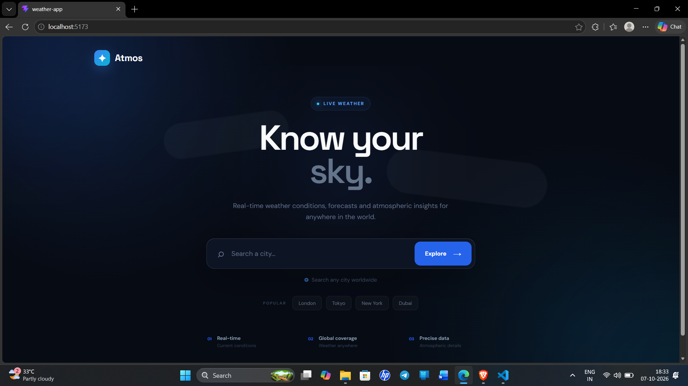
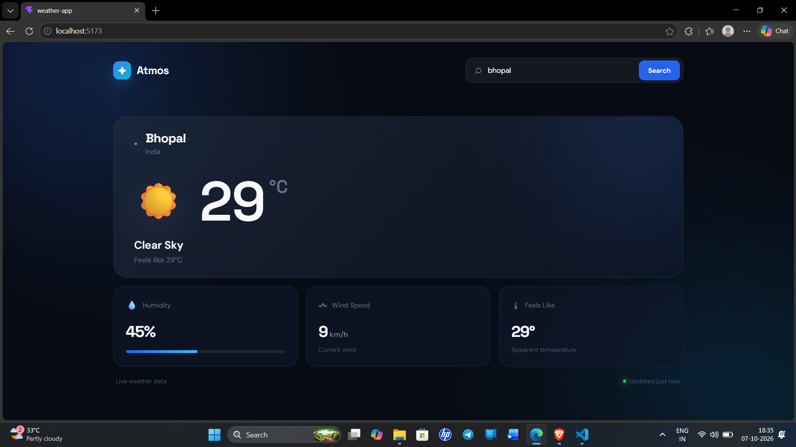

# 🌤️ Atmos — Weather App

A modern weather application built with **React, TypeScript, Vite, and Open-Meteo API**.

Atmos allows users to search for any city and view real-time weather information including temperature, humidity, wind speed, feels-like temperature, and current weather conditions.

The project was built as a practical way to learn and apply **TypeScript with React**, including interfaces, union types, typed API responses, typed React state, type narrowing, and reusable utility functions.

## 📸 Screenshots

### Landing Page



### Weather Dashboard




---

## ✨ Features

- 🌍 Search weather for cities around the world
- 🌡️ Current temperature
- 💧 Humidity information
- 💨 Wind speed
- 🌡️ Feels-like temperature
- ☀️ Weather condition and weather icons
- 🔎 City search using geocoding
- ⚡ Loading states
- ❌ Error handling for invalid cities
- 📱 Responsive design
- 🎨 Modern dark UI
- ⌨️ Search using the Enter key
- 🧩 Strong TypeScript typing throughout the application

---

## 🛠️ Tech Stack

### Frontend

- React
- TypeScript
- Vite
- CSS

### API

- Open-Meteo Weather API
- Open-Meteo Geocoding API

---

## 📁 Project Structure

```text
src/
├── services/
│   └── weatherApi.ts
│
├── types/
│   └── weather.ts
│
├── utils/
│   └── weatherUtils.ts
│
├── App.tsx
├── App.css
├── index.css
└── main.tsx